
**Packages**

``` r
library(tidyverse)
library(lubridate)
library(mlr)
library(mlrMBO)
library(parallelMap)
library(parallel)
library(lightgbm)
library(Matrix)
library(gridExtra)
library(DataExplorer)
library(RcppRoll)
library(scales)
library(ggforce)
library(reshape2)
library(stringi)
library(ggcorrplot)
library(broom)
```

1 Introduction
==============

This notebook is a solution for the "Predict Future Sales" competition from Kaggle.com. The goal is to forecast the total amount of all products sold in every shop for the next month.

Following variables are included:

-   ID: an Id that represents a (Shop, Item) tuple within the test set.
-   shop\_id: unique identifier of a shop.
-   item\_id: unique identifier of a product.
-   item\_category\_id: unique identifier of item category.
-   item\_cnt\_day: number of products sold (Goal is to predict a monthly amount of this measure).
-   item\_price: current price of an item.
-   date: date in format dd/mm/yyyy.
-   date\_block\_num: a consecutive month number.
-   item\_name: name of item.
-   shop\_name: name of shop.
-   item\_category\_name: name of item category.

2 Reading data
==============

``` r
train = read.csv(gzfile("sales_train.csv.gz", encoding = "UTF-8"))

glimpse(train)
```

    ## Observations: 2,935,849
    ## Variables: 6
    ## $ date           <fct> 02.01.2013, 03.01.2013, 05.01.2013, 06.01.2013,...
    ## $ date_block_num <int> 0, 0, 0, 0, 0, 0, 0, 0, 0, 0, 0, 0, 0, 0, 0, 0,...
    ## $ shop_id        <int> 59, 25, 25, 25, 25, 25, 25, 25, 25, 25, 25, 25,...
    ## $ item_id        <int> 22154, 2552, 2552, 2554, 2555, 2564, 2565, 2572...
    ## $ item_price     <dbl> 999.00, 899.00, 899.00, 1709.05, 1099.00, 349.0...
    ## $ item_cnt_day   <dbl> 1, 1, -1, 1, 1, 1, 1, 1, 1, 3, 2, 1, 1, 2, 1, 2...

``` r
test = read.csv(gzfile("test.csv.gz"))

glimpse(test)
```

    ## Observations: 214,200
    ## Variables: 3
    ## $ ID      <int> 0, 1, 2, 3, 4, 5, 6, 7, 8, 9, 10, 11, 12, 13, 14, 15, ...
    ## $ shop_id <int> 5, 5, 5, 5, 5, 5, 5, 5, 5, 5, 5, 5, 5, 5, 5, 5, 5, 5, ...
    ## $ item_id <int> 5037, 5320, 5233, 5232, 5268, 5039, 5041, 5046, 5319, ...

``` r
items = read.csv("items.csv", encoding = "UTF-8")

items$item_name =  iconv(items$item_name, "UTF-8", "UTF-8")

glimpse(items)
```

    ## Observations: 22,170
    ## Variables: 3
    ## $ item_name        <chr> "! <U+0412><U+041E> <U+0412><U+041B><U+0410><U+0421><U+0422><U+0418> <U+041D><U+0410><U+0412><U+0410><U+0416><U+0414><U+0415><U+041D><U+0418><U+042F> (<U+041F><U+041B><U+0410><U+0421><U+0422>.)         D", ...
    ## $ item_id          <int> 0, 1, 2, 3, 4, 5, 6, 7, 8, 9, 10, 11, 12, 13,...
    ## $ item_category_id <int> 40, 76, 40, 40, 40, 40, 40, 40, 40, 40, 40, 4...

``` r
item_categories = read.csv("item_categories.csv", encoding = "UTF-8")

item_categories$item_category_name =  iconv(item_categories$item_category_name, "UTF-8", "UTF-8")

glimpse(item_categories)
```

    ## Observations: 84
    ## Variables: 2
    ## $ item_category_name <chr> "PC - <U+0413><U+0430><U+0440><U+043D><U+0438><U+0442><U+0443><U+0440><U+044B>/<U+041D><U+0430><U+0443><U+0448><U+043D><U+0438><U+043A><U+0438>", "<U+0410><U+043A><U+0441><U+0435><U+0441><U+0441><U+0443><U+0430><U+0440><U+044B> - PS...
    ## $ item_category_id   <int> 0, 1, 2, 3, 4, 5, 6, 7, 8, 9, 10, 11, 12, 1...

``` r
shops = read.csv("shops.csv", encoding = "UTF-8")

shops$shop_name =  iconv(shops$shop_name, "UTF-8", "UTF-8")

glimpse(shops)
```

    ## Observations: 60
    ## Variables: 2
    ## $ shop_name <chr> "!<U+042F><U+043A><U+0443><U+0442><U+0441><U+043A> <U+041E><U+0440><U+0434><U+0436><U+043E><U+043D><U+0438><U+043A><U+0438><U+0434><U+0437><U+0435>, 56 <U+0444><U+0440><U+0430><U+043D>", "!<U+042F><U+043A><U+0443><U+0442><U+0441><U+043A> <U+0422><U+0426> \"<U+0426><U+0435><U+043D><U+0442><U+0440>...
    ## $ shop_id   <int> 0, 1, 2, 3, 4, 5, 6, 7, 8, 9, 10, 11, 12, 13, 14, 15...

3 Data wrangling
================

**Merging data**

First, the data containing the additional information will be merged to the train and test set.

``` r
train_merged = left_join(train, shops) %>%
    left_join(., items) %>%
    left_join(.,item_categories)

glimpse(train_merged)
```

    ## Observations: 2,935,849
    ## Variables: 10
    ## $ date               <fct> 02.01.2013, 03.01.2013, 05.01.2013, 06.01.2...
    ## $ date_block_num     <int> 0, 0, 0, 0, 0, 0, 0, 0, 0, 0, 0, 0, 0, 0, 0...
    ## $ shop_id            <int> 59, 25, 25, 25, 25, 25, 25, 25, 25, 25, 25,...
    ## $ item_id            <int> 22154, 2552, 2552, 2554, 2555, 2564, 2565, ...
    ## $ item_price         <dbl> 999.00, 899.00, 899.00, 1709.05, 1099.00, 3...
    ## $ item_cnt_day       <dbl> 1, 1, -1, 1, 1, 1, 1, 1, 1, 3, 2, 1, 1, 2, ...
    ## $ shop_name          <chr> "<U+042F><U+0440><U+043E><U+0441><U+043B><U+0430><U+0432><U+043B><U+044C> <U+0422><U+0426> \"<U+0410><U+043B><U+044C><U+0442><U+0430><U+0438><U+0440>\"", "<U+041C><U+043E><U+0441><U+043A><U+0432><U+0430> <U+0422><U+0420><U+041A> \"<U+0410>...
    ## $ item_name          <chr> "<U+042F><U+0412><U+041B><U+0415><U+041D><U+0418><U+0415> 2012 (BD)", "DEEP PURPLE  The Hous...
    ## $ item_category_id   <int> 37, 58, 58, 58, 56, 59, 56, 55, 55, 55, 55,...
    ## $ item_category_name <chr> "<U+041A><U+0438><U+043D><U+043E> - Blu-Ray", "<U+041C><U+0443><U+0437><U+044B><U+043A><U+0430> - <U+0412><U+0438><U+043D><U+0438><U+043B>", "<U+041C><U+0443><U+0437><U+044B><U+043A><U+0430>...

``` r
test_merged = left_join(test, shops) %>%
    left_join(., items) %>%
    left_join(., item_categories)


glimpse(test_merged)
```

    ## Observations: 214,200
    ## Variables: 7
    ## $ ID                 <int> 0, 1, 2, 3, 4, 5, 6, 7, 8, 9, 10, 11, 12, 1...
    ## $ shop_id            <int> 5, 5, 5, 5, 5, 5, 5, 5, 5, 5, 5, 5, 5, 5, 5...
    ## $ item_id            <int> 5037, 5320, 5233, 5232, 5268, 5039, 5041, 5...
    ## $ shop_name          <chr> "<U+0412><U+043E><U+043B><U+043E><U+0433><U+0434><U+0430> <U+0422><U+0420><U+0426> \"<U+041C><U+0430><U+0440><U+043C><U+0435><U+043B><U+0430><U+0434>\"", "<U+0412><U+043E><U+043B><U+043E><U+0433><U+0434><U+0430> <U+0422><U+0420><U+0426> \"...
    ## $ item_name          <chr> "NHL 15 [PS3, <U+0440><U+0443><U+0441><U+0441><U+043A><U+0438><U+0435> <U+0441><U+0443><U+0431><U+0442><U+0438><U+0442><U+0440><U+044B>]", "ONE DIRE...
    ## $ item_category_id   <int> 19, 55, 19, 23, 20, 23, 20, 55, 55, 20, 30,...
    ## $ item_category_name <chr> "<U+0418><U+0433><U+0440><U+044B> - PS3", "<U+041C><U+0443><U+0437><U+044B><U+043A><U+0430> - CD <U+043B><U+043E><U+043A><U+0430><U+043B><U+044C><U+043D><U+043E><U+0433><U+043E> <U+043F><U+0440><U+043E><U+0438><U+0437>...

**Extracting the city**

The variable shop\_name contains the city, the location and the name of a shop. However, I only extract the cities and convert them into numeric.

``` r
unique(train_merged$shop_name)[1:5]
```

    ## [1] "<U+042F><U+0440><U+043E><U+0441><U+043B><U+0430><U+0432><U+043B><U+044C> <U+0422><U+0426> \"<U+0410><U+043B><U+044C><U+0442><U+0430><U+0438><U+0440>\""
    ## [2] "<U+041C><U+043E><U+0441><U+043A><U+0432><U+0430> <U+0422><U+0420><U+041A> \"<U+0410><U+0442><U+0440><U+0438><U+0443><U+043C>\""
    ## [3] "<U+041C><U+043E><U+0441><U+043A><U+0432><U+0430> <U+0422><U+041A> \"<U+0411><U+0443><U+0434><U+0435><U+043D><U+043E><U+0432><U+0441><U+043A><U+0438><U+0439>\" (<U+043F><U+0430><U+0432>.<U+041A>7)"
    ## [4] "<U+041C><U+043E><U+0441><U+043A><U+0432><U+0430> <U+0422><U+041A> \"<U+0411><U+0443><U+0434><U+0435><U+043D><U+043E><U+0432><U+0441><U+043A><U+0438><U+0439>\" (<U+043F><U+0430><U+0432>.<U+0410>2)"
    ## [5] "<U+041A><U+0443><U+0440><U+0441><U+043A> <U+0422><U+0426> \"<U+041F><U+0443><U+0448><U+043A><U+0438><U+043D><U+0441><U+043A><U+0438><U+0439>\""

``` r
train_merged  = train_merged %>%
    separate(shop_name, into = c("city", "location"), sep = " ") %>%
    mutate(city = gsub("!", "", city)) %>%
    mutate(city = as.numeric(as.factor(city))) %>%
    select(-location)
```

``` r
unique(train_merged$city)[1:5]
```

    ## [1] 31 14 13 12  3

**Extracting categories**

The variable item\_name contains a more aggregated version of the item categories.

``` r
unique(train_merged$item_category_name)[1:5]
```

    ## [1] "<U+041A><U+0438><U+043D><U+043E> - Blu-Ray"
    ## [2] "<U+041C><U+0443><U+0437><U+044B><U+043A><U+0430> - <U+0412><U+0438><U+043D><U+0438><U+043B>"
    ## [3] "<U+041C><U+0443><U+0437><U+044B><U+043A><U+0430> - CD <U+0444><U+0438><U+0440><U+043C><U+0435><U+043D><U+043D><U+043E><U+0433><U+043E> <U+043F><U+0440><U+043E><U+0438><U+0437><U+0432><U+043E><U+0434><U+0441><U+0442><U+0432><U+0430>"
    ## [4] "<U+041C><U+0443><U+0437><U+044B><U+043A><U+0430> - <U+041C><U+0443><U+0437><U+044B><U+043A><U+0430><U+043B><U+044C><U+043D><U+043E><U+0435> <U+0432><U+0438><U+0434><U+0435><U+043E>"
    ## [5] "<U+041C><U+0443><U+0437><U+044B><U+043A><U+0430> - CD <U+043B><U+043E><U+043A><U+0430><U+043B><U+044C><U+043D><U+043E><U+0433><U+043E> <U+043F><U+0440><U+043E><U+0438><U+0437><U+0432><U+043E><U+0434><U+0441><U+0442><U+0432><U+0430>"

I also extract this information and convert them into numeric.

``` r
train_merged = train_merged %>%
    separate(item_category_name, into = c("item_main_category_id", "rest"), sep = " ") %>%
    mutate(item_main_category_id = as.numeric(as.factor(item_main_category_id))) %>%
    select(-rest, -item_name)
```

``` r
unique(train_merged$item_main_category_id)[1:5]
```

    ## [1]  7  9  5 11  8

3 Data cleaning
===============

3.1 Data consitency
-------------------

Many item and shop combinations which are in the train set are not in the test set.

``` r
train_merged %>%
  anti_join(test_merged, by = c("shop_id", "item_id")) %>%
  nrow()
```

    ## [1] 1711410

Also, many item and shop combinations which are in the test are not in the train set.

``` r
test_merged %>%
  anti_join(train_merged, by = c("shop_id", "item_id")) %>%
  nrow()
```

    ## [1] 102796

**Subsetting the data**

From now, I only use those data which are in the train and the test set to keep the data small. However, this would not be possible in a real world scenario since I would have no access to the test data.

``` r
train_sub = train_merged %>%
    semi_join(test_merged, by = c("shop_id", "item_id"))
```

3.2 Missing values
------------------

There are no missings in the data.

``` r
plot_missing(train_sub)
```

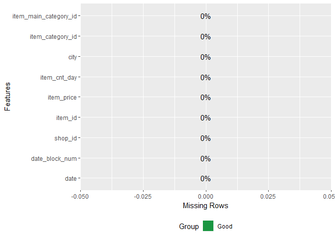

3.3 Outliers
------------

There seem to be some outliers in item\_price and item\_cnt\_day.

``` r
plot_histogram(train_sub)
```

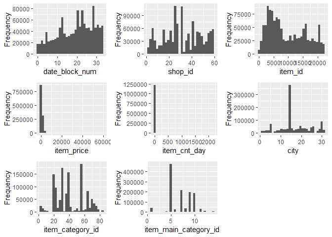

**item\_cnt\_day**

For item\_cnt\_day there are two extreme outliers.

``` r
train_sub %>%
    ggplot(aes(x = "", y = item_cnt_day)) +
    geom_boxplot() +
    labs(x = "", y = "item_cnt_day") +
    theme_minimal()
```

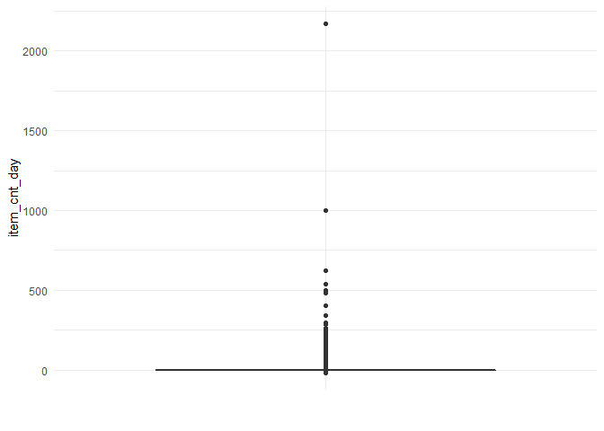

Both cases seem to be an irregular event.

``` r
train_sub %>%
  filter(item_cnt_day > 750) %>%
  select(-city, -item_main_category_id, -date_block_num)
```

    ##         date shop_id item_id item_price item_cnt_day item_category_id
    ## 1 15.01.2015      12   20949  4.0000000         1000               71
    ## 2 28.10.2015      12   11373  0.9087137         2169                9

Therefore, all values will be removed that are larger than 750.

``` r
train_sub = train_sub %>%
    filter(item_cnt_day < 750)
```

**item\_price**

Here there is a similar situation as above.

``` r
train_sub %>%
    ggplot(aes(x = "", y = item_price)) +
    geom_boxplot() +
    labs(x = "", y = "item_price") +
    theme_minimal()
```

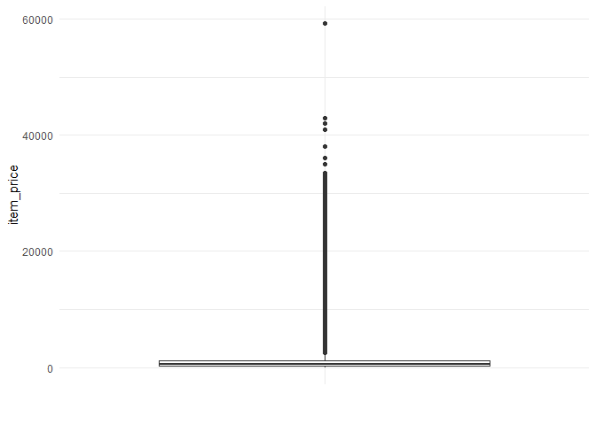

``` r
train_sub %>%
  filter(item_price > 50000) %>%
  select(-city, -item_main_category_id, -date_block_num)
```

    ##         date shop_id item_id item_price item_cnt_day item_category_id
    ## 1 17.09.2013      12   11365      59200            1                9

All values will be removed that are larger than 50000.

``` r
train_sub = train_sub %>% 
    filter(item_price < 50000)
```

3.4 Duplicates
--------------

Overall, there are six rows which are duplicates, which will be removed.

``` r
train_sub %>% 
    filter(duplicated(.))
```

    ##         date date_block_num shop_id item_id item_price item_cnt_day city
    ## 1 23.02.2014             13      50    3423        999            1   25
    ## 2 23.03.2014             14      21    3423        999            1   14
    ## 3 01.05.2014             16      50    3423        999            1   25
    ## 4 12.07.2014             18      25    3423        999            1   14
    ## 5 31.12.2014             23      42   21619        499            1   20
    ##   item_category_id item_main_category_id
    ## 1               23                     5
    ## 2               23                     5
    ## 3               23                     5
    ## 4               23                     5
    ## 5               37                     7

``` r
train_sub = train_sub %>% 
    filter(!duplicated(.))
```

4 EDA
=====

**Time range**

The time series in the training set starts at the first month of 2013 (date\_block\_num -&gt; 0) and ends at the 10th month of 2015 (date\_block\_num -&gt; 33).

``` r
min(dmy(train_sub$date))
```

    ## [1] "2013-01-01"

``` r
min(train_sub$date_block_num)
```

    ## [1] 0

``` r
max(dmy(train_sub$date))
```

    ## [1] "2015-10-31"

``` r
max(train_sub$date_block_num)
```

    ## [1] 33

**Shop Listing**

Not all shops and items are listed every day/month.

``` r
train_sub %>%
  mutate(date = dmy(date)) %>%
  arrange(date, shop_id, item_id) %>%
  filter(shop_id == 2) %>%
  filter(item_id == 1905) %>%
  head(5)
```

    ##         date date_block_num shop_id item_id item_price item_cnt_day city
    ## 1 2013-01-01              0       2    1905        249            1    1
    ## 2 2013-01-05              0       2    1905        249            1    1
    ## 3 2013-01-15              0       2    1905        249            1    1
    ## 4 2013-04-13              3       2    1905        249            1    1
    ## 5 2013-04-15              3       2    1905        249            1    1
    ##   item_category_id item_main_category_id
    ## 1               30                     5
    ## 2               30                     5
    ## 3               30                     5
    ## 4               30                     5
    ## 5               30                     5

They are just listed if a transaction take place.

``` r
train_sub %>%
  mutate(date = dmy(date)) %>%
  arrange(date, shop_id, item_id) %>%
  filter(shop_id == 2) %>%
  filter(item_cnt_day == 0) %>%
  filter(item_id == 1905) %>%
  head(5)
```

    ## [1] date                  date_block_num        shop_id              
    ## [4] item_id               item_price            item_cnt_day         
    ## [7] city                  item_category_id      item_main_category_id
    ## <0 rows> (or 0-length row.names)

**Sales and returns over time**

Sales and returns increase over time and they have a similar pattern. Moreover, there are some seasonal influences, so year and month are important information for predicting sales. The period of interest is right before the holiday sales peak.

``` r
train_sub %>%
  group_by(date_block_num) %>%
  summarise(item_cnt_month = sum(item_cnt_day), 
            returns = sum(item_cnt_day * item_price)) %>%
  gather(variable, value, -date_block_num) %>%
  ggplot(aes(date_block_num, value)) +
  geom_point() +
  geom_line() +
  geom_smooth(method = "loess") +
  facet_wrap_paginate(~variable, scales = "free", nrow = 3) +
  labs(x = NULL, y = NULL) +
  theme_minimal() +
  scale_x_continuous(breaks = c(0:33, 1)) +
  geom_vline(xintercept = c(10, 22), colour="red", linetype = "dashed")
```

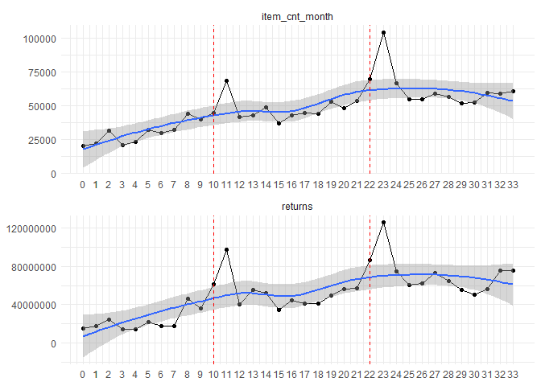

**city and shop\_id**

Let´s take a look which cities and shops have the most sales. One city has more clearly more sales then the others. Also, there are some shops which have

``` r
sa_ci = train_sub %>%
  group_by(city) %>%
  summarise(total_sales = sum(item_cnt_day)) %>%
  mutate(city = reorder(city, total_sales)) %>%
  ggplot(aes(city, total_sales)) +
  geom_bar(stat = "identity") +
  theme_minimal() +
  coord_flip() 

sa_sh = train_sub %>%
  group_by(shop_id) %>%
  summarise(total_sales = sum(item_cnt_day)) %>%
  mutate(shop_id = as.factor(shop_id)) %>%
  mutate(shop_id = reorder(shop_id, total_sales)) %>%
  ggplot(aes(shop_id, total_sales)) +
  geom_bar(stat = "identity") +
  theme_minimal() +
  coord_flip() 


grid.arrange(sa_ci, sa_sh, ncol = 2)
```

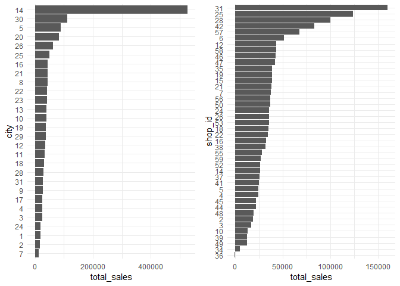

**categories**

We can also take a look at the (main) categories and check which ones have the most sales.

``` r
sa_imc = train_sub %>%
    group_by(item_main_category_id) %>%
    summarise(total_sales = sum(item_cnt_day)) %>%
    mutate(item_main_category_id = reorder(item_main_category_id, total_sales)) %>%
    ggplot(aes(item_main_category_id, total_sales)) +
    geom_bar(stat = "identity") +
    theme_minimal() +
    coord_flip() 

sa_ic = train_sub %>%
    group_by(item_category_id) %>%
    summarise(total_sales = sum(item_cnt_day)) %>%
    top_n(30, total_sales) %>%
    mutate(item_category_id = reorder(item_category_id, total_sales)) %>%
    ggplot(aes(item_category_id, total_sales)) +
    geom_bar(stat = "identity") +
    theme_minimal() +
    coord_flip() 


grid.arrange(sa_imc, sa_ic, ncol = 2)
```

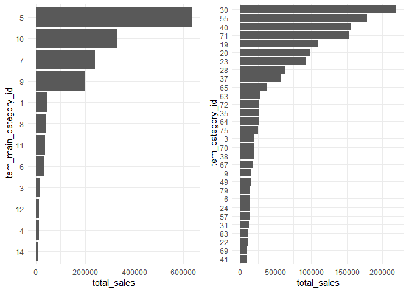

**items**

If we look at the items most of them were sold rarely. On the other hand, one item sold significantly more than the others.

``` r
sa_i = train_sub %>%
  group_by(item_id) %>%
  summarise(total_sales = sum(item_cnt_day)) %>%
  ggplot(aes(x = total_sales)) +
  geom_density() +
  theme_minimal() +
  xlim(0, 15000)


sa_it10 = train_sub %>%
  group_by(item_id) %>%
  summarise(total_sales = sum(item_cnt_day)) %>%
  arrange(-total_sales) %>%
  head(10) %>%
  mutate(item_id = as.factor(item_id)) %>%
  mutate(item_id = reorder(item_id, total_sales)) %>%
  ggplot(aes(x = item_id, y = total_sales)) +
  geom_bar(stat = "identity") +
  coord_flip() +
  theme_minimal()

grid.arrange(sa_i, sa_it10, ncol = 2)
```

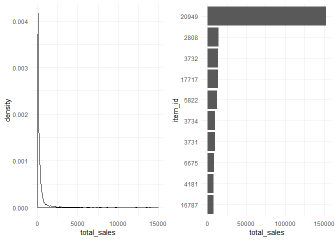

5 Feature Engeneering
=====================

**Creating the data set**

First, I create a train set that contains every distinct shop\_id and item\_id combination for every month because the item\_ids/shop\_ids are only listed if a transaction take place. Moreover, I aggregate the item\_cnt\_month and returns (item\_cnt \* item\_price) to a monthly level. For the missing values (e.g. those months no transaction took place I impute a 0). Then I add the test set to the train set.

``` r
train_temp = train_sub %>%
  select(shop_id, item_category_id, item_id) %>%
  distinct()

train_temp = crossing(date_block_num = 0:33, train_temp)

test_temp = test_merged %>%
  select(shop_id, item_category_id, item_id) %>%
  mutate(date_block_num = 34) 

full_temp = rbind(train_temp, test_temp)

features = train_sub %>%
  group_by(date_block_num, shop_id, item_id) %>%
  summarise(item_cnt_month = sum(item_cnt_day),
            returns = sum(item_cnt_day * item_price))


cities = train_merged %>%
  select(city, shop_id) %>%
  distinct()

cats = train_merged %>%
  select(item_category_id, item_main_category_id) %>%
  distinct()

dates = train_merged %>%
  mutate(date = dmy(date),
         year = year(date), 
         month = month(date)) %>%
  select(date_block_num, year, month) %>%
  distinct()


full_temp = left_join(full_temp, features) %>%
  left_join(., dates) %>%
  left_join(., cities) %>%
  left_join(., cats) 


full_temp$year[is.na(full_temp$year)] = 2015
full_temp$month[is.na(full_temp$month)] = 11


full_temp[is.na(full_temp)] = 0
```

**Creating lags**

Now, I create a one month lag for item\_cnt\_month and returns since the goal of this competition are to predict the sales for the next month. I also calculate the rolling mean for 3, 6 and 12 months. Furthermore, I aggregate the monthly sales per city, shop, item\_main\_category\_id, and item\_category\_id by a monthly average. Those features will be also lagged by one month.

``` r
city_sales = full_temp %>%
  group_by(date_block_num, city) %>%
  summarise(city_sales = mean(item_cnt_month)) %>%
  group_by(city) %>%
  mutate(lag1_city_sales = lag(city_sales, 1)) %>%
  select(-city_sales)
  

shop_sales = full_temp %>%
  group_by(date_block_num, shop_id) %>%
  summarise(shop_sales = mean(item_cnt_month)) %>%
  group_by(shop_id) %>%
  mutate(lag1_shop_sales = lag(shop_sales, 1)) %>%
  select(-shop_sales)


item_main_categoriy_sales =  full_temp %>%
  group_by(date_block_num, shop_id, item_main_category_id) %>%
  summarise(main_category_sales = mean(item_cnt_month)) %>%
  group_by(shop_id, item_main_category_id) %>%
  mutate(lag1_main_category_sales = lag(main_category_sales, 1)) %>%
  select(-main_category_sales)


item_category_sales =  full_temp %>%
  group_by(date_block_num, shop_id, item_category_id) %>%
  summarise(category_sales = mean(item_cnt_month)) %>%
  group_by(shop_id, item_category_id) %>%
  mutate(lag1_category_sales = lag(category_sales, 1)) %>%
  select(-category_sales)


item_sales = full_temp %>%
  group_by(shop_id, item_id) %>%
  mutate(lag1_item_cnt_month = lag(item_cnt_month, 1),
         lag1_returns = lag(returns, 1),
         avg3_item_cnt_month = lag(roll_meanr(item_cnt_month, 3), 1),
         avg3_returns = lag(roll_meanr(returns, 3), 1),
         avg6_item_cnt_month = lag(roll_meanr(item_cnt_month, 6), 1),
         avg6_returns = lag(roll_meanr(returns, 6), 1),
         avg9_item_cnt_month = lag(roll_meanr(item_cnt_month, 9), 1),
         avg9_returns = lag(roll_meanr(returns, 9), 1),
         avg12_item_cnt_month = lag(roll_meanr(item_cnt_month, 12), 1),
         avg12_returns = lag(roll_meanr(returns, 12), 1)) %>%
  select(-item_cnt_month)


final = full_temp %>%
  left_join(city_sales) %>%
  left_join(., shop_sales) %>%
  left_join(., item_category_sales) %>%
  left_join(., item_main_categoriy_sales) %>%
  left_join(., item_sales)
```

The final data set look like this.

``` r
glimpse(final)
```

    ## Observations: 4,001,936
    ## Variables: 24
    ## $ date_block_num           <dbl> 0, 0, 0, 0, 0, 0, 0, 0, 0, 0, 0, 0, 0...
    ## $ shop_id                  <int> 59, 25, 25, 25, 25, 25, 25, 25, 25, 2...
    ## $ item_category_id         <int> 37, 55, 55, 55, 30, 30, 58, 55, 55, 5...
    ## $ item_id                  <int> 22154, 2574, 2607, 2614, 2808, 2703, ...
    ## $ item_cnt_month           <dbl> 1, 13, 2, 2, 30, 10, 1, 2, 1, 1, 7, 1...
    ## $ returns                  <dbl> 999.0, 5187.0, 558.0, 598.0, 29970.0,...
    ## $ year                     <dbl> 2013, 2013, 2013, 2013, 2013, 2013, 2...
    ## $ month                    <dbl> 1, 1, 1, 1, 1, 1, 1, 1, 1, 1, 1, 1, 1...
    ## $ city                     <dbl> 31, 14, 14, 14, 14, 14, 14, 14, 14, 1...
    ## $ item_main_category_id    <dbl> 7, 9, 9, 9, 5, 5, 9, 9, 9, 9, 5, 5, 9...
    ## $ lag1_city_sales          <dbl> NA, NA, NA, NA, NA, NA, NA, NA, NA, N...
    ## $ lag1_shop_sales          <dbl> NA, NA, NA, NA, NA, NA, NA, NA, NA, N...
    ## $ lag1_category_sales      <dbl> NA, NA, NA, NA, NA, NA, NA, NA, NA, N...
    ## $ lag1_main_category_sales <dbl> NA, NA, NA, NA, NA, NA, NA, NA, NA, N...
    ## $ lag1_item_cnt_month      <dbl> NA, NA, NA, NA, NA, NA, NA, NA, NA, N...
    ## $ lag1_returns             <dbl> NA, NA, NA, NA, NA, NA, NA, NA, NA, N...
    ## $ avg3_item_cnt_month      <dbl> NA, NA, NA, NA, NA, NA, NA, NA, NA, N...
    ## $ avg3_returns             <dbl> NA, NA, NA, NA, NA, NA, NA, NA, NA, N...
    ## $ avg6_item_cnt_month      <dbl> NA, NA, NA, NA, NA, NA, NA, NA, NA, N...
    ## $ avg6_returns             <dbl> NA, NA, NA, NA, NA, NA, NA, NA, NA, N...
    ## $ avg9_item_cnt_month      <dbl> NA, NA, NA, NA, NA, NA, NA, NA, NA, N...
    ## $ avg9_returns             <dbl> NA, NA, NA, NA, NA, NA, NA, NA, NA, N...
    ## $ avg12_item_cnt_month     <dbl> NA, NA, NA, NA, NA, NA, NA, NA, NA, N...
    ## $ avg12_returns            <dbl> NA, NA, NA, NA, NA, NA, NA, NA, NA, N...

**Creating the train and test partition**

As you can see, there are some NA values in the data because of the rolling mean. Therefore, I remove the first 13 months from the train set. I also convert shop\_id, item\_main\_category\_id, and item\_category\_id and city into a factor.

``` r
final_train = final %>% 
  filter(!date_block_num %in% c(0:12, 34)) %>%
  select(-date_block_num, -returns) 
```

For the test set, there are also some NA values since not every shop\_id/item\_id combination which is in the test set appears in the train set. These NA value will be replaced with 0 because they got 0 sales the months before.

``` r
final_test = final %>% 
  filter(date_block_num %in% c(34)) %>%
  select(-date_block_num, -returns)

final_test[is.na(final_test)] = 0
```

**Correlation**

Let´s take a look at the correlations. All variables have a significant correlation with the target (item\_cnt\_month). The features which were build based on the target variable (e.g. the one month lag of item\_cnt\_month) have the highest correlation with the target. Also, the features containing the returns are positively correlated with the target. There are also some intercorrelations between the features.

``` r
cor = cor(final_train)

p_cor = cor_pmat(final_train)

ggcorrplot(cor, 
           hc.order = TRUE, 
           p.mat = p_cor)
```

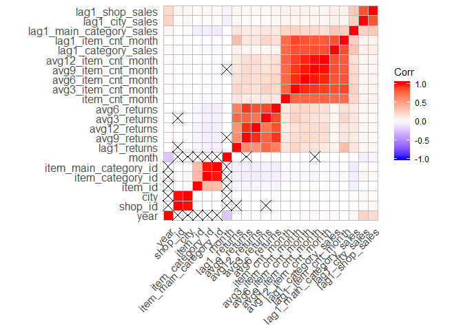

6 Modeling
==========

For modeling, I use an elastic net regression since there is huge amount of multicollinearity in the data.

**Creating the tasks**

First, I create the train tasks.

``` r
train_task = makeRegrTask(data = final_train, target = "item_cnt_month")
test_task = makeRegrTask(data = final_test, target = "item_cnt_month")
```

Then I tune the model.

``` r
glmnet = makeLearner("regr.glmnet")

params = makeParamSet(makeNumericParam("alpha",lower = 0,upper = 1), 
                      makeNumericParam("s",lower = 0 ,upper = 1))


mbo.ctrl = makeMBOControl()
mbo.ctrl = setMBOControlTermination(mbo.ctrl, iters = 3)
ctrl = makeTuneControlMBO(mbo.control = mbo.ctrl)


set.seed(3)
rdesc = makeResampleDesc("CV", 
                         iters = 5)  

glmnet_tune = tuneParams(learner = glmnet, 
                         par.set = params,
                         task = train_task, 
                         resampling = rdesc,
                         control = ctrl, 
                         measures = list(rmse))
```

On cross validation the model got an RMSE of 2.61

``` r
glmnet_tune$y
```

    ## rmse.test.rmse 
    ##       2.612025

``` r
glmnet_tune$x
```

    ## $alpha
    ## [1] 0.6229851
    ## 
    ## $s
    ## [1] 0.00002505381

**Training the model**

Now, I apply the tuned hyperparameters to the learner and train it.

``` r
mod_glm = setHyperPars(glmnet, par.vals = glmnet_tune$x)

fit = train(glmnet, train_task)
```

**Model Evaluation**

Firt, I take a look at the beta values. Most influential are the features calculated for item\_cnt\_month.

``` r
as.data.frame(as.matrix(predict(fit$learner.model , type="coef", s = glmnet_tune$x$s))) %>%
  rownames_to_column(var = "Variable") %>%
  rename(Beta = "1") %>%
  filter(Variable != "(Intercept)") %>%
  mutate(Variable = reorder(Variable, -Beta)) %>%
  ggplot(aes(x = Variable, y = Beta)) +
  geom_bar(stat = "identity") +
  coord_flip() +
  theme_minimal()
```

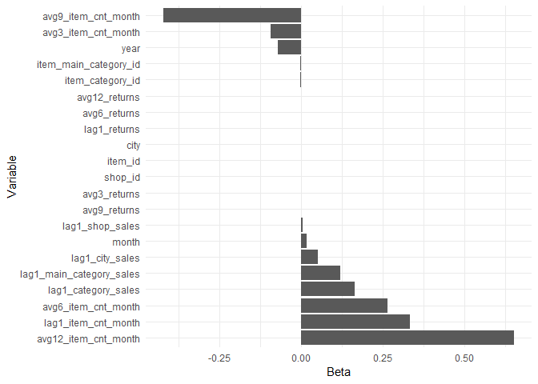

We can also take a look at the actual and the predicted values in the training set. Overall, the model fits the data well, beside the peak at December (i.e. date\_block\_num = 23). However, since the goal is to predict the values for November 2015 (i.e. date\_block\_num = 34) the model fits the data quiet well.

``` r
preds = predict(fit, train_task)

d = final %>% 
  filter(!date_block_num %in% c(0:12, 34)) %>%
  select(date_block_num) 

preds$data$date_block_num = d$date_block_num

sums = preds$data %>% 
  group_by(date_block_num) %>% 
  summarize(actual = sum(truth),
            predicted = sum(response)) %>% 
  gather(sum, item_cnt_month_sum, -date_block_num)  

sums %>%
  ggplot(aes(date_block_num, item_cnt_month_sum, color = sum)) +
  geom_point() +
  geom_line() +
  theme_minimal() +
  scale_x_continuous(breaks=seq(13,33,1)) +
  geom_vline(xintercept = c(22), colour="red", linetype = "dashed")
```

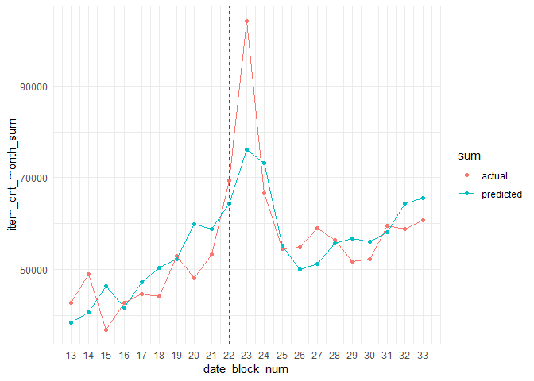

7 Submission
============

Finaly, I apply the tuned model to the test set a create the submission file.

``` r
pred = predict(fit, test_task)

submit = data.frame(ID = test$ID, item_cnt_month = pred$data$response)

write.csv(submit, file = "submit.csv", row.names = FALSE)
```
